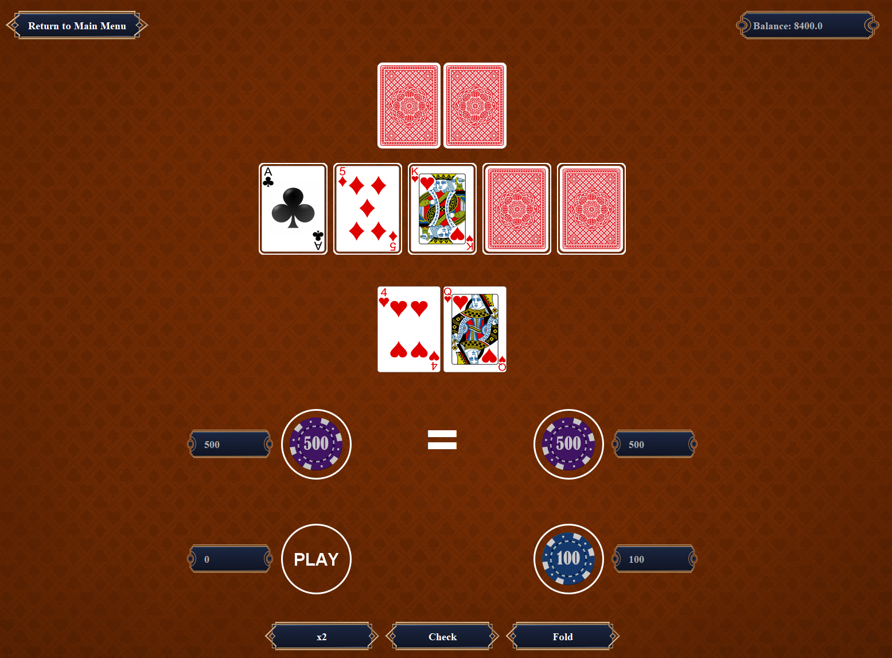

# ElysiumCasino

A Java-based casino game that offers both a Graphical User Interface **(GUI)** and a Command-Line Interface **(CLI)**. Play classic casino games like **Blackjack**, **Baccarat**, and **Ultimate Texas Hold'em**, all from the comfort of your own machine!

## Table of Contents
- [Overview](#overview)
- [Features](#features)
- [Requirements](#requirements)
- [Installation & Setup](#installation--setup)
  - [1. Cloning & Building from Source](#1-cloning--building-from-source)
  - [2. Running the Executables](#2-running-the-executables)
- [Screenshots](#screenshots)
- [Known Limitations](#known-limitations)
- [Contributing](#contributing)
- [License](#license)

---

## Overview
**ElysiumCasino** is a fun, educational, or just plain entertaining casino game simulator. You can choose:
- A **GUI version** with a visual interface for a more immersive experience.
- A **CLI version** for lightweight usage, ideal for minimal resources or scripting.

**Why ElysiumCasino?**
- Perfect for learning about casino mechanics, trying out betting strategies, or just having fun without real-world risks.
- Built with Java and Gradle for easy extensibility and cross-platform compatibility.

---

## Features
- **Multiple Games:** Offers classic casino game experiences such as **Blackjack**, **Baccarat**, and **Ultimate Texas Hold'em**.
- **Two Interfaces:**
  - **GUI:** A fully interactive windowed application (requires a sufficiently large screen).
  - **CLI:** A simple text-based interface.
- **Extensible:** Easily add new games or features due to clean modular design.

---

## Requirements
1. **Java 17** (or higher) is recommended.
2. **Gradle** (if you plan to build from source).  
   > *Note:* The repository may include a Gradle Wrapper (`gradlew`), which means you don’t need to install Gradle explicitly—just run `./gradlew` (Linux/macOS) or `gradlew.bat` (Windows).
3. A machine running **Windows**, **macOS**, or **Linux** should work, though the prebuilt executables are currently **Windows-only**.

---

## Installation & Setup

### 1. Cloning & Building from Source

1. **Clone this repository:**
   ```bash
   git clone https://github.com/DanielRizk/ElysiumCasino.git
   ```
2. **Navigate** to the project folder:
   ```bash
   cd ElysiumCasino
   ```
3. **Build** the project:
   - Using the Gradle Wrapper:
     ```bash
     ./gradlew build
     ```
     (On Windows, use `gradlew.bat build`)
   - Or, if you have Gradle installed system-wide:
     ```bash
     gradle build
     ```
4. **Run** the game (CLI or UI):
   ```bash
   ./gradlew ui:Run
   ```
   or

   ```bash
   ./gradlew cli:Run
   ```
   
   Check the project’s `build.gradle` or `settings.gradle` for more details.

### 2. Running the Executables
If you **do not** want to build from source or need a quick start:
1. Go to the [Releases](https://github.com/DanielRizk/ElysiumCasino/releases) page.
2. Download the **`ElysiumCasino-x.y.exe`** file for the **GUI** version (where `x.y` is the current version).
3. Download the **`ElysiumCasino-Lite-x.y.exe`** file for the **CLI** version.
4. Double-click the desired `.exe` to run on Windows.

---

## Screenshots
Here are some screenshots from the game, enjoy

### GUI




### CLI


---

## Known Limitations
- **GUI Minimum Resolution**: Currently **1600×1200 px** is required for the GUI to display properly. Smaller screens may encounter scaling or layout issues.
- This is an early release. Bugs or missing features may still exist.

---

## Contributing
I welcome all contributions—bug reports, feature requests, and pull requests!

1. **Fork** the project.
2. Create a new branch for your feature or bug fix.
3. Submit a pull request explaining your changes.

Please open an [issue](https://github.com/DanielRizk/ElysiumCasino/issues) if you have any questions or encounter any problems.

---

## License
This project is licensed under the MIT License. See the [LICENSE](LICENSE) file for details.

